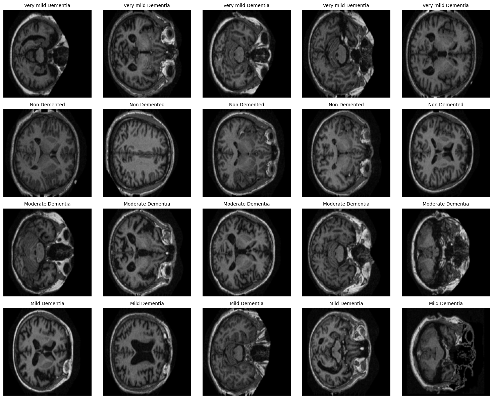

# Dementia Classification using CNN

This project implements a Convolutional Neural Network to classify brain MRI scans into four categories of dementia severity: Non-Demented, Very Mild Dementia, Mild Dementia, and Moderate Dementia. The final model achieved **99.52% training accuracy** and **99.99% test accuracy** with a loss of **0.00047**.

## Project Files

This repository contains:
- `dementia.py` - Main training script
- `README.md` - This file
- `requirements.txt` - Python dependencies

**Note:** The Data folder containing four category subfolders with MRI images needs to be downloaded separately.

## How to Run the Program

### Step 1: Extract the Repository
Clone or download this repository to your device.

### Step 2: Prepare Data Folder
- Download the data from: [Google Drive Link](https://drive.google.com/file/d/1MQJbT5mP8zx2BcmC3m5NXwzDLNr_jqmU/view?usp=sharing)
- Place the extracted data folder inside the dementia folder as such:
```
dementia/
├── dementia.py
├── requirements.txt
├── README.md
└── Data/
    ├── Non Demented/
    ├── Very mild Dementia/
    ├── Mild Dementia/
    └── Moderate Dementia/
```

### Step 3: Run the Program
- To train without saving: `python dementia.py Data`
- To train and save the model: `python dementia.py Data model_name.h5`

The program will load images, split the data into training (60%) and testing (40%) sets, train for 10 epochs, evaluate performance, and optionally save the model if a filename is provided.

**Training takes approximately 108 minutes on CPU.**

## OASIS Dataset

The Open Access Series of Imaging Studies (OASIS) dataset provides brain MRI scans commonly used for classifying dementia severity. It includes a total of **86,437 grayscale MRI images** categorized into four levels of cognitive decline:

- **NonDemented:** 67,222 images
- **VeryMildDemented:** 13,725 images
- **MildDemented:** 5,002 images
- **ModerateDemented:** 488 images

All images are in JPG format with original dimensions of 496 × 248, and require preprocessing before model training. A notable challenge in this dataset is significant **class imbalance**. Non-Demented scans account for 77.8% of the dataset, whereas Moderate Dementia makes up only 0.6%, which may impact model performance unless handled carefully during training.

After loading the dataset, all MRI scans undergo several preprocessing steps to ensure consistency before model training. Images are:
- Converted from BGR to RGB
- Resized to 128 × 128
- Normalized to a pixel range of [0, 1]

These transformations produce a standardized feature array with shape **(86,437, 128, 128, 3)**, where each image is represented as a 3-channel numerical matrix suitable for neural network input. Labels are converted into one-hot encoded vectors, forming a label array of shape **(86,437, 4)** that corresponds to the four dementia categories.



## Model Architecture


- **Input:** 128x128 RGB images
- **Convolutional Block 1:**
  - Two Conv2D layers (32 filters, 3x3 kernels, ReLU)
  - MaxPooling2D (2x2) + Dropout(0.25)
- **Convolutional Block 2:**
  - Two Conv2D layers (64 filters, 3x3 kernels, ReLU)
  - MaxPooling2D (2x2) + Dropout(0.25)
- **Flatten layer**
- **Dense layer:** 512 units with ReLU + Dropout(0.5)
- **Output layer:** 4 units with Softmax activation
- **Optimizer:** Adam
- **Loss function:** Categorical cross-entropy

## Experimentation Process

### Initial Approach
Dense neural networks with various configurations (256, 512, 1024 nodes) were tested. These networks plateaued at ~70–72% accuracy, demonstrating an inability to capture spatial relationships in MRI images.

### Transition to CNNs
I then transitioned to CNNs, beginning with the simplest possible architecture: a single convolutional layer followed by pooling. To enable rapid experimentation, I trained initial models on only 10% of the dataset, which reduced training time from 90+ minutes to under 10 minutes per configuration. This allowed me to quickly test and eliminate poor architectures before committing to full training runs.

Additionally, I systematically tested multiple architectural variations:
- Kernel sizes (2x2, 3x3)
- Number of convolutional blocks (1, 2, 3)
- Filter progressions (16-32-64 vs 32-64)
- Dense layer sizes (256, 512, 1024 units)
- Dropout rates (0.2, 0.25, 0.5 at different layers)

Each configuration was evaluated on the 10% subset first, and only promising architectures were trained on the full dataset.

### GPU Acceleration
Google Colab Pro with access to GPU compute was critical for this project. CPU training takes over 90 minutes per full training run, making systematic experimentation impractical. GPU acceleration reduced full training time to approximately 15-20 minutes, enabling thorough hyperparameter exploration and multiple full training runs to verify results.

## Key Observations

The final two-block CNN, with 3x3 kernels, 32–64 filters, and an input image size of 128x128, achieved 99.99% test accuracy. Dropout rates of 0.25 in the convolutional blocks and 0.5 in the dense layer effectively prevented overfitting while maintaining high performance.

Data preprocessing—including BGR-to-RGB conversion and normalization—was critical; omitting the BGR conversion reduced accuracy by approximately 5%. The model converged rapidly, reaching 96% training accuracy by epoch 2, indicating that MRI scans contain strong discriminative features.

Prototyping on only 10% of the dataset accelerated the selection of an effective architecture before full-scale training. In contrast, dense networks plateaued at 72% accuracy regardless of configuration, and single convolutional layers reached only ~85%. Adding a third convolutional block increased training time by 40% while improving accuracy by less than 1%. Similarly, using 2x2 kernels reduced performance by 3–4% compared to 3x3 kernels. CPU training proved prohibitively slow for systematic experimentation.

Although the extremely high test accuracy and low loss (0.00047) initially suggested potential overfitting, the large 40% test split and consistent train-test performance confirmed genuine generalization. Performance gains plateaued after epoch 6–7, indicating that 8 epochs would have been sufficient.

Notably, BGR-to-RGB conversion had a significant impact even for grayscale-appearing images, emphasizing the importance of consistent preprocessing. The rapid convergence also suggests that MRI scans contain pronounced structural markers that distinguish between dementia stages.

Overall, the systematic approach—starting simple, prototyping on subsets, and scaling—proved essential for efficient and reliable deep learning experimentation within computational constraints.

## References

- [CMS OASIS Data Sets](https://www.cms.gov/medicare/quality/home-health/oasis-data-sets)
- [TensorFlow CNN Tutorial](https://www.tensorflow.org/tutorials/images/cnn)
- [TensorFlow Image Classification](https://www.tensorflow.org/tutorials/images/classification)
- [Keras Dense Layer API](https://www.tensorflow.org/api_docs/python/tf/keras/layers/Dense)

## Author

Tsering Sherpa
